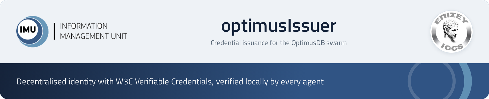
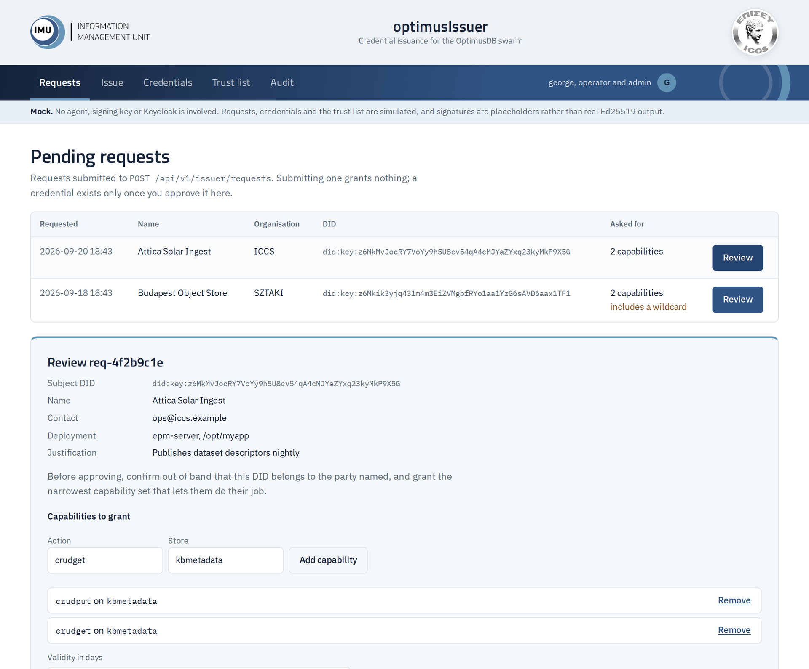
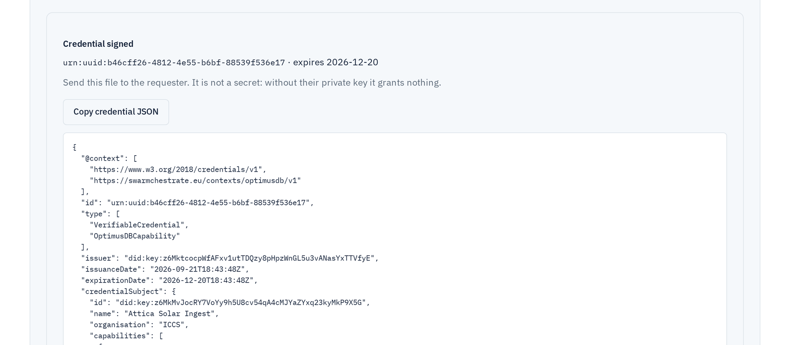
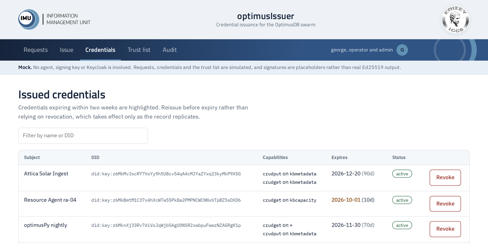
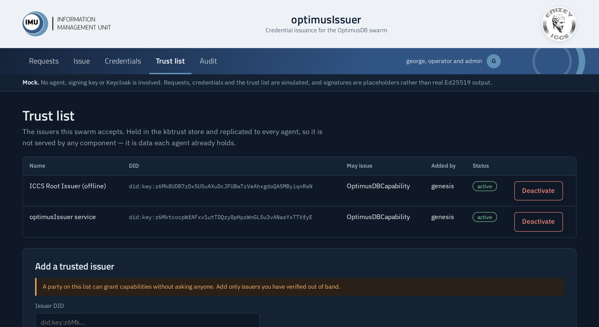
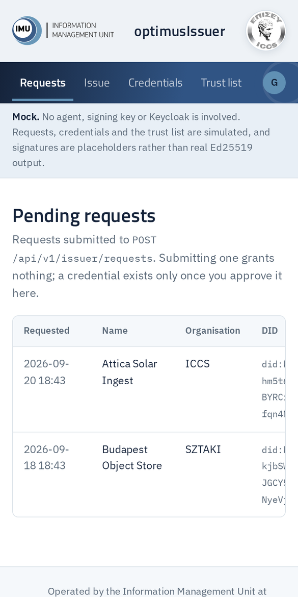
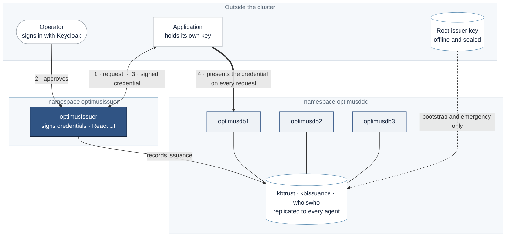
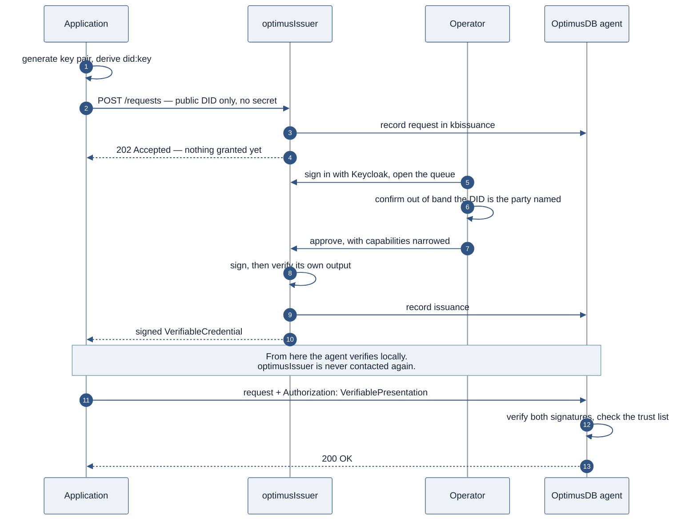

<p align="center">
  
</p>

<p align="center">
  <a href="https://github.com/georgeGeorgakakos/optimusIssuer/actions/workflows/ci.yml"></a>
  <a href="LICENSE"></a>
  
  
  
  
</p>

<p align="center">
  <a href="https://georgegeorgakakos.github.io/optimusIssuer/demo/"><b>Live demo</b></a>
  &nbsp;&nbsp;|&nbsp;&nbsp;
  <a href="#quick-start"><b>Quick start</b></a>
  &nbsp;&nbsp;|&nbsp;&nbsp;
  <a href="#api"><b>API</b></a>
  &nbsp;&nbsp;|&nbsp;&nbsp;
  <a href="#deployment"><b>Deployment</b></a>
  &nbsp;&nbsp;|&nbsp;&nbsp;
  <a href="SECURITY.md"><b>Security</b></a>
</p>

---

OptimusDB agents authenticate callers by verifying **W3C Verifiable Credentials locally** — no authority is contacted at request time. Something, however, has to *sign* those credentials. This is that something: a small Go service with a React interface, holding one Ed25519 key and a set of policies about what it will grant.

It is deliberately the only component in the system that touches issuer private key material, and deliberately the only one that is **not required** for an agent to verify anything.

<br>

## Live demo

<p align="center">
  <a href="https://georgegeorgakakos.github.io/optimusIssuer/demo/">
    
  </a>
</p>

<p align="center">
  <a href="https://georgegeorgakakos.github.io/optimusIssuer/demo/"><b>Open the interactive demo</b></a>
  <br>
  <sub>Runs entirely in your browser with simulated data — no agent, signing key or Keycloak involved.</sub>
</p>

Walk through the whole operator flow:

| | Try this | What you'll see |
|:---:|---|---|
| **1** | Review a pending request | The capability editor, pre-filled with what was asked for, ready to narrow |
| **2** | Approve it | A signed W3C Verifiable Credential, ready to hand back |
| **3** | Approve the SZTAKI request | A second-operator prompt, because it asks for a wildcard |
| **4** | Revoke from *Credentials* | A warning that revocation takes effect as it replicates, not instantly |
| **5** | Add an issuer in *Trust list* | A confirmation spelling out that this delegates signing authority |
| **6** | Open *Audit* | Every action you just took, recorded |

<table>
  <tr>
    <td width="50%" align="center">
      <br>
      <sub><b>A signed credential</b>, returned after approval</sub>
    </td>
    <td width="50%" align="center">
      <br>
      <sub><b>Issued credentials</b>, with expiry highlighted inside two weeks</sub>
    </td>
  </tr>
  <tr>
    <td align="center">
      <br>
      <sub><b>The trust list</b>, in dark mode</sub>
    </td>
    <td align="center">
      <br>
      <sub><b>On a phone</b>, navigation scrolls rather than wraps</sub>
    </td>
  </tr>
</table>

<br>

## Contents

- [At a glance](#at-a-glance)
- [How it fits](#how-it-fits)
- [Quick start](#quick-start)
- [The two-tier key model](#the-two-tier-key-model)
- [API](#api)
- [The interface](#the-interface)
- [Configuration](#configuration)
- [Deployment](#deployment)
- [Security](#security)
- [Development](#development)
- [White label](#white-label)
- [Related projects](#related-projects)

<br>

## At a glance

<table>
  <tr>
    <td width="33%" valign="top">
      <h3>Signs</h3>
      Ed25519 over the <a href="https://www.rfc-editor.org/rfc/rfc8785">JCS</a>-canonicalised credential, then verifies its own output with the same code an agent runs.
    </td>
    <td width="33%" valign="top">
      <h3>Never on the request path</h3>
      Agents verify without calling it. It can be down or unreachable while every existing credential keeps working.
    </td>
    <td width="33%" valign="top">
      <h3>Stateless</h3>
      No database of its own. Requests, issuance records and revocations live in replicated OptimusDB stores.
    </td>
  </tr>
  <tr>
    <td valign="top">
      <h3>Human in the loop</h3>
      Every credential passes an operator. Deciding whom to trust is not a judgement a program should make alone.
    </td>
    <td valign="top">
      <h3>Two keys, not one</h3>
      An offline root authorises the service key and can withdraw it wholesale if the service is compromised.
    </td>
    <td valign="top">
      <h3>One binary</h3>
      The React interface is embedded with <code>go:embed</code>. No node runtime, no web server, nothing else to patch.
    </td>
  </tr>
</table>

### What it deliberately does not do

> [!IMPORTANT]
> **It does not issue automatically.** Every credential passes through a human decision. An automatic issuer with a network-reachable key is a substantially larger target than one that requires an operator to approve.

> [!NOTE]
> **It is not on the request path.** If verification ever came to depend on this service being reachable, the system would have reacquired the central authority the credential model exists to avoid.

<br>

## How it fits



The thick edge is the one taken on every request — and optimusIssuer is not on it. Agents verify credentials locally, so the issuer can be down, redeployed or unreachable while every existing credential keeps working.

<details>
<summary><b>The issuance sequence, step by step</b></summary>
<br>



</details>

<br>

## Quick start

### Run it in Docker

```powershell
.\build-and-run.ps1 run
```

That checks the toolchain, runs the tests, builds the frontend, builds the image, generates a development key, and starts the container. Then open **http://localhost:8090**.

> [!WARNING]
> This runs with operator authentication **disabled** and treats every caller as a local admin. The service logs a warning on every start saying so. Never run it this way anywhere that matters.

### Run it locally, without Docker

```bash
make keygen                 # creates ./dev.key and prints its DID
make dev                    # the service, on :8090
make dev-ui                 # Vite on :5173, proxying /api to :8090
```

### Issue a credential from the command line

`issuerctl` never touches a network. It is the tool for the key ceremony, and for emergency signing when the service is unavailable.

```bash
# the applicant, on their own machine
go run ./cmd/issuerctl keygen --out app.key --label "Attica Solar Ingest"
# did:key:z6MkfMyApp9kWq2fT7nB4pL8sYdX1aH6uJ0eC5rNmQvT

# the issuer, offline
go run ./cmd/issuerctl issue \
    --key issuer.key \
    --subject did:key:z6MkfMyApp9kWq2... \
    --name "Attica Solar Ingest" \
    --capability crudput:kbmetadata \
    --capability crudget:kbmetadata \
    --days 90 \
    --out myapp.vc.json

# anyone, with no network at all
go run ./cmd/issuerctl verify --credential myapp.vc.json
```

```
signature   valid
issuer      did:key:z6MktcocpWfAFxv1utTDQzy8pHpzWnGL5u3vANasYxTTVfyE
subject     did:key:z6MkfMyApp9kWq2fT7nB4pL8sYdX1aH6uJ0eC5rNmQvT
capability  crudput on kbmetadata
capability  crudget on kbmetadata
```

That last step is the whole decentralised claim, demonstrated on one machine: a credential verified with no authority, no registry and no network.

<br>

## The two-tier key model

Putting a signing key in a container means a cluster compromise becomes the ability to mint arbitrary credentials — exactly what an offline key protects against. So the design uses two keys rather than one.

| | Where it lives | Signs | Used |
|---|---|---|---|
| **Root issuer** | Offline, outside the cluster | Only the trust-list entry authorising the service key | Once, plus emergencies |
| **Service issuer** | Kubernetes Secret, mounted read-only | Day-to-day application credentials | Constantly |

```bash
issuerctl genesis \
  --key root.key    --name "ICCS Root Issuer (offline)" \
  --key service.key --name "optimusIssuer service" \
  --out issuers.json
```

If the service key is compromised, the root key signs one record marking it inactive. Every credential it ever issued stops verifying, across the whole swarm, without redeploying anything.

> [!CAUTION]
> **Without the root tier**, recovering from a compromise means editing the genesis ConfigMap and restarting every agent, because nobody retains the authority to revoke. A single issuer is not a single point of failure for verification — but it is one for *recovery*.

<br>

## API

Base path `/api/v1/issuer`, in three privilege tiers.

| Tier | Requires | Endpoints |
|---|---|---|
| Public | nothing | `GET /health`, `GET /info`, `POST /requests` |
| Operator | Keycloak role `issuer:operator` | queue, approve, reject, issue, list, revoke, trust, audit |
| Admin | Keycloak role `issuer:admin` | `POST /trust` — adding or deactivating an issuer |

<details>
<summary><b>Public endpoints</b></summary>
<br>

| | | |
|---|---|---|
| `GET` | `/health` | Service and agent reachability |
| `GET` | `/info` | Issuer DID and policy limits |
| `POST` | `/requests` | Submit a credential request |

```bash
curl -s -X POST https://.../issuer/api/v1/issuer/requests \
  -H 'Content-Type: application/json' \
  -d '{
    "subject_did": "did:key:z6MkfMyApp9kWq2...",
    "name": "Attica Solar Ingest",
    "organisation": "ICCS",
    "contact": "ops@iccs.example",
    "justification": "Publishes dataset descriptors nightly",
    "requested_capabilities": [
      { "action": "crudput", "store": "kbmetadata" },
      { "action": "crudget", "store": "kbmetadata" }
    ],
    "requested_validity_days": 90
  }'
```

```json
{ "request_id": "req-4f2b9c1e",
  "status": "pending_approval",
  "message": "An operator must approve this request before a credential is signed. Nothing has been granted." }
```

This endpoint is unauthenticated on purpose: the payload carries no secret, and refusing anonymous requests would mean every applicant needed a credential to ask for a credential.

</details>

<details>
<summary><b>Operator endpoints</b> — requires <code>issuer:operator</code></summary>
<br>

| | | |
|---|---|---|
| `GET` | `/requests?status=pending` | The approval queue |
| `POST` | `/requests/{id}/approve` | Approve and sign |
| `POST` | `/requests/{id}/reject` | Reject with a reason |
| `POST` | `/credentials` | Issue directly, outside the queue |
| `GET` | `/credentials` | Everything issued |
| `POST` | `/credentials/{id}/revoke` | Revoke |
| `GET` | `/trust` | Read the trust list |
| `GET` | `/audit` | Recent actions |

</details>

<details>
<summary><b>Admin endpoints</b> — requires <code>issuer:admin</code></summary>
<br>

| | | |
|---|---|---|
| `POST` | `/trust` | Add or deactivate a trusted issuer |

Adding an issuer delegates the ability to grant capabilities to another party, until it is deactivated. Every agent will accept what that party signs.

</details>

<br>

## The interface

Five views, in the order an operator uses them.

| View | Purpose |
|---|---|
| **Requests** | The approval queue. Approving opens a capability editor pre-filled with the request, for the operator to narrow before signing. |
| **Issue** | Direct issuance, for cases that did not come through the queue — reissuing after an expiry, for instance. |
| **Credentials** | Everything issued, with expiry highlighted inside two weeks, and a revoke action. |
| **Trust list** | The issuers this swarm accepts. Adding one is behind a confirmation that spells out what it means. |
| **Audit** | What operators did in this process. |

Wildcard capabilities are highlighted wherever they appear. With `-require-second-approval`, a credential containing one cannot be issued by a single operator.

<br>

## Configuration

<details>
<summary><b>All command-line flags</b></summary>
<br>

| Flag | Default | Purpose |
|---|---|---|
| `-addr` | `:8090` | Listen address |
| `-key` | `/etc/issuer/key/issuer.key` | Issuer key file. Must be mode 0600 |
| `-agent` | `http://optimusdb1:8089` | OptimusDB agent base URL |
| `-agent-context` | `swarmkb` | Agent API context |
| `-oidc-issuer` | *(empty)* | Keycloak realm URL. **Empty disables operator auth** |
| `-oidc-audience` | `optimusissuer` | Expected audience claim |
| `-max-validity-days` | `365` | Longest credential this issuer will sign |
| `-default-validity-days` | `90` | Applied when none is named |
| `-require-second-approval` | `true` | Two operators for any wildcard capability |
| `-allowed-actions` | *(empty)* | Allow-list bounding what may be granted |
| `-cors-origins` | *(empty)* | For a separately hosted frontend |

| Environment variable | Purpose |
|---|---|
| `OPTIMUS_ALLOW_INSECURE_KEY_PERMS=1` | Skip the key-file permission check. **Development only** — Docker Desktop on Windows reports every bind-mounted file as mode 0777. A Kubernetes Secret reports the real mode, so this is never set there. |

</details>

<br>

## Deployment

```bash
kubectl apply -f deploy/01-namespace.yaml

# produce the Secret where the key is, apply it, then destroy the local copy
kubectl -n optimusissuer create secret generic issuer-key \
    --from-file=issuer.key=./service.key \
    --dry-run=client -o yaml > secret.yaml
kubectl apply -f secret.yaml && shred -u secret.yaml

kubectl apply -f deploy/03-deployment.yaml
kubectl apply -f deploy/04-ingressroute.yaml
kubectl apply -f deploy/05-networkpolicy.yaml

# into the agents' namespace, not this one
kubectl apply -f deploy/06-genesis-configmap.yaml
```

| Kubernetes object | Change |
|---|---|
| Deployments | **7 → 8** — optimusIssuer is the only addition |
| New ports, volumes, databases | none |
| Agent Deployments | unchanged, apart from one mounted ConfigMap |

One replica, deliberately. A second would place another copy of the key in memory for no availability gain, since the service is not on the request path.

<br>

## Security

The full model, reporting process and compromise procedure are in **[SECURITY.md](SECURITY.md)**. In brief:

- **The key is a file, never an environment variable.** Environment variables appear in `kubectl describe pod`, in crash dumps and in child processes.
- **The service refuses to start on a loose key file** — mode 0600, or it exits.
- **Egress is restricted** by NetworkPolicy to the agents, Keycloak and DNS.
- **Read-only root filesystem**, running as UID 10001, with every capability dropped.
- **Every credential is verified immediately after signing**, so a canonicalisation defect fails at issuance rather than in the field.
- **Revocation is not immediate.** It takes effect as the record replicates; short credential lifetimes are the primary control.

<br>

## Development

```bash
make build      # both binaries
make test       # Go tests, no network required
make vet
make image
```

<details>
<summary><b>Keeping canonicalisation in step with the agents</b></summary>
<br>

`internal/did` and `internal/canonical` must produce **byte-identical output** to the verifier inside the OptimusDB agent. If the two diverge, every credential fails to verify, and the symptom is a signature error — which sends people to look at key handling rather than serialisation.

The safest arrangement is for the agent to vendor these two packages rather than reimplement them. Otherwise, run the test vectors in `internal/credential/roundtrip_test.go` against both.

</details>

<details>
<summary><b>If the interface returns 404</b></summary>
<br>

The React build is embedded by a directive in `cmd/issuerd/main.go`, which must sit on the line **directly above** the variable:

```go
//go:embed all:webdist
var webdist embed.FS
```

Without it, `webdist` is a valid but empty filesystem. The program still compiles, starts cleanly and serves nothing at all — with no error anywhere. Check this first.

</details>

<br>

## White label

Everything partner-specific lives in two places, and no page component needs to change:

| File | Holds |
|---|---|
| `web/src/brand.js` | Product name, tagline, footer, and which logo goes where |
| `web/src/styles.css` | The `--brand-*` colour tokens at the top |

Replace the logos in `web/src/assets`, adjust those two files, and rebuild.

<br>

## Related projects

| | |
|---|---|
| **OptimusDB** | The agent swarm that verifies these credentials |
| **OptimusDDC** | The catalog front end, which keeps its Keycloak browser session |
| **optimusPy** | Client library that holds a credential and presents it |

<br>

---

<p align="center">
  <sub>
    Developed by the <b>Information Management Unit</b> at the <b>Institute of Communication and Computer Systems</b>
    for the <b>Swarmchestrate</b> project, funded by the European Union's Horizon Europe programme under grant agreement 101135012.
    <br><br>
    Released under the <a href="LICENSE">MIT licence</a>.
  </sub>
</p>
